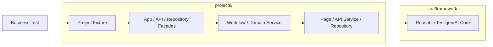
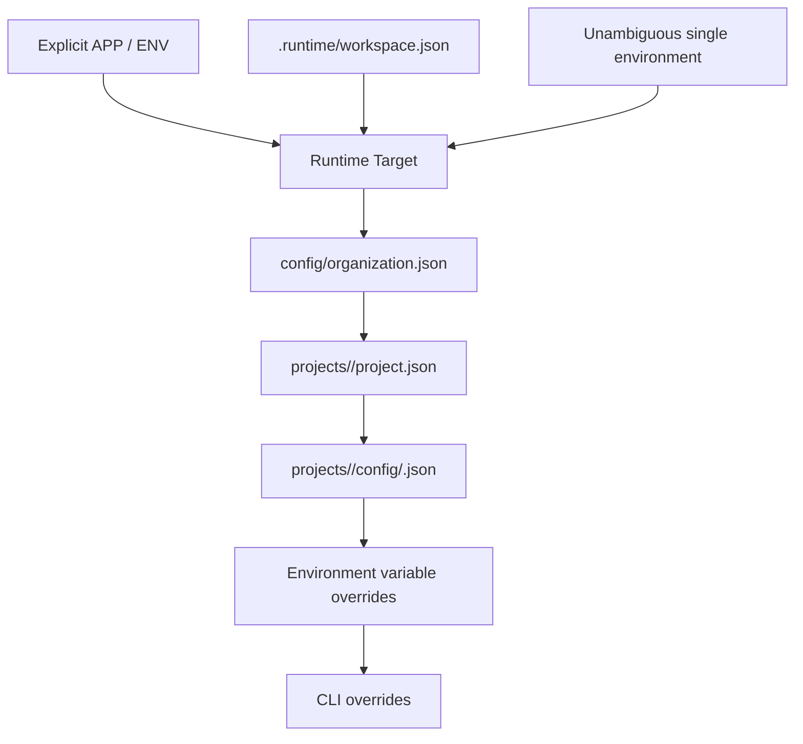
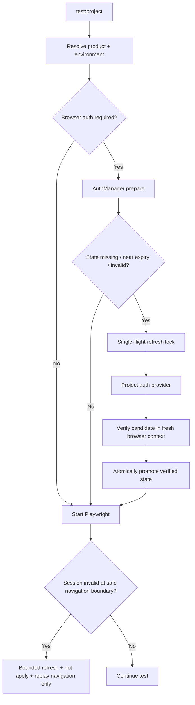
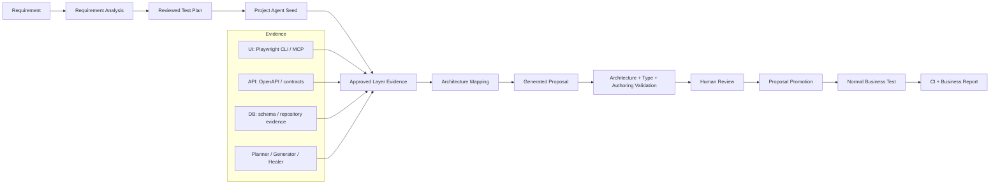
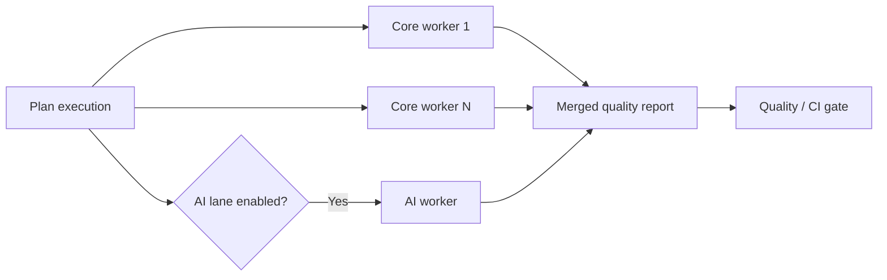

<div align="center">

# TestigentAI

### Intelligent Quality Engineering Platform

**A multi-project Playwright + TypeScript platform for UI, API, database, data-driven, reporting, self-healing, AI-assisted and CI/CD quality engineering.**

<p>
  
  
  
  
  
  
  
</p>

**One reusable core. Many products. Explicit project ownership. Business-readable quality reporting.**

[Quick Start](#quick-start) · [Agent Development](#agent-driven-automation-development) · [Architecture](#architecture) · [Add a Product](#onboard-a-new-product) · [Reporting](#business-standard-reporting) · [CI/CD](#cicd) · [Documentation](#documentation-map)

</div>

---

## Current Release State

**Development candidate: `v1.6.0`** — adds deterministic claim provenance, one-click evidence verification, explainable score-free release risk, advisory change-impact analysis, incremental migration slices and an explicit false-heal safety benchmark. Connected Node 22 validation and PR/PR-rerun CI are green. Pre-tag main CI additionally proved the AI retry contract and exposed a final GitHub partial-rerun artifact-acquisition edge; this candidate uses authenticated workflow-run artifact downloads plus fail-safe evidence retention so the provenance resolver can verify prior/current attempt evidence without relying on a mutable latest pointer. `v1.5.3` remains the certified tag until the replacement main CI and compatibility matrix pass.

**Stable certified baseline: `v1.5.3`** — Node.js 22.x, main multi-project CI green, AI healing lane green on trusted `main`, rerun-safe report provenance enabled, and the tag-triggered Release Compatibility matrix certified on Ubuntu/Chromium, Ubuntu/Firefox, Ubuntu/WebKit, macOS/WebKit and Windows/Chromium.

For the exact certified run IDs, release commit, current CI topology and operational status, see [`docs/41-CURRENT-RELEASE-STATUS.md`](docs/41-CURRENT-RELEASE-STATUS.md). For daily Git/PR/CI/release commands, see [`docs/40-GIT-GITHUB-CLI-TERMINAL-GUIDE.md`](docs/40-GIT-GITHUB-CLI-TERMINAL-GUIDE.md).

---

## Why TestigentAI?

TestigentAI is designed for teams that want more than a collection of Playwright tests. It provides a governed quality-engineering platform where reusable technical capability stays centralized while every application keeps its own business logic, selectors, APIs, repositories, data and authentication behavior.

> **Core design rule**
> Reusable capability belongs in `src/framework/`. Product/application behavior belongs in `projects/<project>/`.

That rule makes the framework reusable across teams without turning it into a single-product automation repository.

### What the platform covers

| Capability | What TestigentAI provides |
|---|---|
| 🎭 **UI automation** | Playwright Page Objects, workflows, web-first assertions, governed locator plans |
| 🔌 **API testing** | Reusable HTTP infrastructure with project-owned domain services and payloads |
| 🗄️ **Database validation** | Capability-aware Postgres/MySQL/MSSQL support with project-owned repositories |
| 📊 **Data-driven testing** | JSON, CSV, YAML and spreadsheet-oriented data flows with parallel-safe identities |
| 🔐 **Authentication** | Verified storage state, project-owned auth providers, auto refresh and bounded runtime recovery |
| 🩹 **Self-healing** | UI recovery: deterministic fallback, validated cache and lazy optional AI fallback with semantic post-conditions |
| 🤖 **Agent-driven automation** | Layer-aware UI/API/DB/E2E proposal authoring from approved evidence with explicit human approval/promotion |
| ✨ **AI / agent quality** | Provider-neutral, opt-in AI contracts, healing support, MCP tooling and AI-lane reporting |
| 🧠 **Requirement intelligence** | Requirement analysis, test-plan generation, review-gated proposals and application knowledge |
| 🧾 **Business reporting** | Executive KPIs, known-defect semantics, evidence, steps, merged shard reporting and email preview |
| 🔎 **Quality evidence graph** | One-click claim verification with formulas, source fields, requirements, scenarios, defects, healing, AI audit and materialized evidence |
| 🧭 **Change impact** | Explainable, advisory changed-code test selection with transitive project dependency reasons and fail-safe shared-core handling |
| 🚦 **Execution governance** | Profiles, lanes, tags, workers, retries, sharding and zero-selection protection |
| 🔄 **CI/CD** | GitHub Actions and Azure Pipelines with sequential, sharded and optional AI execution |
| 🛡️ **Quality gates** | Architecture, scale, reporting, type, framework, documentation and security contracts |

---

## Architecture



### Dependency rules

- `src/framework/` never imports a product project.
- A project never imports another project.
- Product selectors, routes, SQL, domain payloads and workflows stay in that product.
- Business specs consume typed project fixtures/facades rather than constructing framework infrastructure directly.
- `npm run architecture:check` enforces the boundary.

### Repository shape

```text
TestigentAI/
├── src/framework/                 # Reusable platform engines
│   ├── core/                      # Runtime config, fixtures, auth, UI foundations
│   ├── api/                       # Generic API infrastructure
│   ├── database/                  # Generic DB infrastructure
│   ├── data/                      # Reusable data readers / execution support
│   ├── reporting/                 # Business + technical reporting
│   ├── healing/                   # Governed locator recovery
│   ├── ai/                        # Provider-neutral AI abstractions
│   └── intelligence/              # Requirements, knowledge and generation
│
├── projects/
│   ├── demo/                      # Deterministic reference project
│   └── sdet-practice/             # Authenticated real-world example
│       ├── auth/                   # Product-owned auth provider
│       ├── config/                 # Environment config
│       ├── fixtures/               # Product dependency boundary
│       ├── src/pages/              # UI mechanics / locator plans
│       ├── src/workflows/          # Business journeys
│       ├── src/api/                # Domain API services
│       ├── src/database/           # Domain repositories
│       ├── data/                   # Product test data
│       ├── requirements/           # Requirement inputs
│       └── tests/                  # Business / capability specs
│
├── tests/framework/               # Platform regression contracts only
├── templates/project/             # New-product skeleton
├── config/                        # Organization-wide policy
├── docs/                          # Detailed product documentation
├── scripts/                       # Governed CLI / CI / reporting operations
├── agent-prompts/                 # Enterprise agent policy / authoring guardrails
├── .github/agents/                # Planner / generator / healer agent definitions
├── .mcp/ + .mcp.json              # Playwright MCP configuration examples
├── .github/workflows/             # GitHub Actions
├── azure-pipelines.yml            # Azure Pipelines
└── playwright.config.ts           # Thin adapter over runtime configuration
```

---

## Quick Start

### Prerequisites

- **Node.js 22.x**
- npm
- Git
- Chromium for the recommended first run
- GitHub CLI (`gh`) for PR/CI/release operations (recommended for contributors)

Git/`gh` installation, authentication and daily terminal operations are documented in [`docs/40-GIT-GITHUB-CLI-TERMINAL-GUIDE.md`](docs/40-GIT-GITHUB-CLI-TERMINAL-GUIDE.md).

### 1. Install

```bash
npm ci
npx playwright install chromium
```

### 2. Discover available products

```bash
npm run project:list
```

### 3. Select a local workspace

```bash
npm run qa:use -- demo qa
npm run qa:doctor
```

Local selection is stored in gitignored `.runtime/workspace.json`. CI should always set `APP` and `ENV` explicitly.

### 4. Run tests

```bash
npm run qa:test -- --project=chromium
```

### 5. Open the report

```bash
npm run qa:report
npm run qa:impact -- --base main --head HEAD
npm run qa:migrate -- projects/<project>/tests
```

### 6. Validate the framework/repository

```bash
npm run validate:final
```

---

## Daily Developer Workflow

The recommended surface for most engineers is intentionally small:

```bash
npm run qa:status
npm run qa:doctor
npm run qa:new -- <requirement-id-or-file>
npm run qa:test -- --project=chromium
npm run qa:validate
npm run qa:report
npm run qa:impact -- --base main --head HEAD
npm run qa:migrate -- projects/<project>/tests
```

For auth-required products:

```bash
npm run auth:check
npm run auth:prepare
```

For MFA/manual-only authentication:

```bash
npm run qa:auth
```

For source-healing maintenance proposals:

```bash
npm run qa:heal
```

For **new automation development with agents**, `qa:new` defaults to governed agent mode:

```bash
npm run qa:new -- checkout
# equivalent to:
npm run qa:new -- checkout --mode=agents
```

> New joiners should start with `qa:*`. Advanced scripts are available, but they are not required for normal daily execution.

---

## Multi-Project / Customer Portfolio Execution

A single TestigentAI installation can serve **one product, a selected set of products, a named customer portfolio, or every registered project**. The runner discovers projects from `projects/<project>/config`; new projects automatically participate in `--all` without editing a hard-coded list.

### Run one project

```bash
APP=portal ENV=qa npm run test:project -- --project=chromium
```

### Run selected projects

```bash
npm run test:projects -- \
  --apps=portal,payments,claims \
  --env=qa \
  --profile=regression \
  --project=chromium
```

### Use different environments per project

```bash
npm run test:projects -- \
  --apps=portal,payments,claims \
  --env-map=portal:qa,payments:uat,claims:qa \
  --profile=regression \
  --project=chromium
```

### Run every registered project

```bash
npm run test:projects -- \
  --all \
  --env=qa \
  --profile=regression \
  --project=chromium
```

`--all` is dynamic. If a team later adds `projects/customer-search/config/qa.json`, that project is automatically discovered.

### Customer / portfolio groups

For customers that own several products, define a reusable group in `config/project-groups.json`:

```json
{
  "groups": {
    "customer-a": {
      "description": "Customer A digital estate",
      "projects": ["portal", "payments", "claims"],
      "environments": {
        "portal": "qa",
        "payments": "uat",
        "claims": "qa"
      }
    }
  }
}
```

Then run the customer portfolio with one command:

```bash
npm run test:projects -- \
  --group=customer-a \
  --profile=regression \
  --project=chromium
```

Useful portfolio options:

| Option | Purpose |
|---|---|
| `--all` | Run every registered project |
| `--apps=a,b,c` | Run an ad-hoc subset |
| `--group=name` | Run a reusable customer/product group |
| `--env=qa` | Apply one environment to every selected project |
| `--env-map=a:qa,b:uat` | Use project-specific environments |
| `--profile=pr|smoke|regression|nightly|release` | Apply a common execution profile |
| `--include-ai` | Explicitly permit `@ai` tests; provider configuration is still required |
| `--fail-fast` | Stop after the first failed project |
| `--dry-run` | Print the resolved project/environment plan without executing |

By default, TestigentAI **continues through all selected projects** even if one project fails, then exits non-zero at the end. This gives customers a complete estate-level result instead of hiding later project outcomes.

Each product keeps its own auth state, test data and business report under `reports/<APP>/<ENV>/<RUN_ID>/...`. Portfolio execution writes both a deterministic summary and a stakeholder-friendly estate view:

```text
reports/multi-project/<RUN_ID>/summary.json   # run-scoped machine-readable source
reports/multi-project/<RUN_ID>/index.html    # run-scoped business portfolio dashboard
```

The portfolio dashboard keeps business language at the top: project gate, selected/executed/not-applicable/blocked scenarios, quality failures, known defects, CI blockers, validated healing and AI-call counts. Technical evidence remains inside each product report.

For all executable automated tests including AI-tagged tests, explicitly opt in and configure the AI provider:

```bash
AI_ENABLED=true \
AI_PROVIDER_MODE=single \
AI_PROVIDER=<approved-provider> \
HEALING_AI_ENABLED=true \
npm run test:projects -- \
  --group=customer-a \
  --profile=nightly \
  --include-ai \
  --project=chromium
```

Provider endpoint/model/key variables remain in local or CI secrets. Cloud providers also require the explicit cloud-egress policy switch documented in `.env.example`; never place provider secrets in source control.

Manual tests and review-blocked generated proposals remain excluded by governance.

---

## Bundled Product Examples

### `demo`

A deterministic reference product used for framework contracts, sample UI/API flows and clean onboarding examples.

```bash
npm run qa:use -- demo qa
npm run qa:doctor
npm run qa:test -- --project=chromium
```

### `sdet-practice`

An authenticated product example that demonstrates:

- project-owned API-based login provider
- verified browser storage state
- automatic auth refresh
- PR/smoke execution
- business-standard known-defect reporting
- CI-safe non-AI and optional AI lanes

Set `AUTH_USERNAME` and `AUTH_PASSWORD` through local secret configuration or protected CI variables before authenticated execution; the repository intentionally contains no credential fallback.

```bash
npm run qa:use -- sdet-practice qa
npm run auth:check
npm run auth:prepare

TEST_PROFILE=pr \
npm run test:project -- \
  --project=chromium \
  --grep-invert="@ai"

npm run report:open
```

The example is intentionally product-owned. Its authentication endpoint, token key, locators and domain behavior do **not** live in reusable framework core.

---

## Onboard a New Product

Do not copy another product folder by hand. Generate a governed skeleton:

```bash
npm run project:new -- checkout
```

Then configure:

```text
projects/checkout/
├── project.json
├── config/qa.json
├── auth/auth.provider.ts          # only when non-interactive auth is needed
├── fixtures/test.fixture.ts
├── src/app.facade.ts
├── src/pages/
├── src/workflows/
├── src/api/
├── src/database/
├── data/
├── requirements/
└── tests/
```

### Product ownership guide

| Put this in the product | Example |
|---|---|
| Page selectors and atomic actions | `src/pages/checkout.page.ts` |
| Business journeys | `src/workflows/checkout.workflow.ts` |
| Domain API routes/payloads | `src/api/order.service.ts` |
| Domain SQL/repositories | `src/database/order.repository.ts` |
| Test datasets | `data/checkout.yaml` |
| Environment URLs / non-secrets | `config/qa.json` |
| Authentication mechanics | `auth/auth.provider.ts` |
| Executable business specs | `tests/.../*.spec.ts` |

### Validate the new product

```bash
npm run architecture:check
APP=checkout ENV=qa npm run project:check
APP=checkout ENV=qa npm run test:project -- --project=chromium
```

A new product should not require changes in `src/framework/` unless the team is adding a capability that is truly reusable across products.

---

## Configuration Model

Runtime configuration is resolved in a predictable order:



The reusable runtime intentionally has **no silent `demo/qa` fallback**.

Organization policy owns shared defaults such as workers, retries, browsers and artifacts. Product/environment layers override only what they need.

---

## Execution Profiles and Quality Lanes

### Profiles

| Profile | Typical purpose | Default intent |
|---|---|---|
| `pr` | Pull-request confidence | fast `@smoke`, AI off |
| `smoke` | Critical business confidence | fast `@smoke` |
| `regression` | Broad functional coverage | excludes manual scenarios |
| `nightly` | Wider / heavier execution | more workers, AI may be allowed |
| `release` | Release gate | strict, minimal tolerance |
| `custom` | Product/team override | explicit project policy |

Examples:

```bash
APP=checkout ENV=qa TEST_PROFILE=pr npm run test:project -- --project=chromium
APP=checkout ENV=qa npm run test:profile:regression -- --project=chromium
```

### Lanes

```bash
npm run test:ui
npm run test:api
npm run test:db
npm run test:e2e
npm run test:visual
npm run test:accessibility
npm run test:performance
```

Typical tags include `@smoke`, `@critical`, `@ui`, `@api`, `@db`, `@ai`, `@manual`, `@generated` and `@generated-review`.

The scale audit protects profiles from silently selecting zero scenarios.

---

## Authentication Lifecycle

Authentication lifecycle policy is reusable; login mechanics remain product-owned.



### Normal auth commands

```bash
APP=<project> ENV=qa npm run auth:check
APP=<project> ENV=qa npm run auth:prepare
APP=<project> ENV=qa npm run test:project -- --project=chromium
```

### Security properties

- auth state is verified before promotion
- refreshed state is written atomically
- parallel refresh is single-flight per runner
- session recovery is bounded
- mutating actions are **not blindly replayed**
- `.auth/` remains gitignored
- project credentials never belong in committed project JSON/YAML

For MFA/manual-only flows, use `npm run qa:auth`.

---

## UI, API, Database and Data

### UI

Use Page Objects/LocatorPlans for mechanics and workflows for business journeys. Prefer roles, labels and stable test IDs. Fixed sleeps are not a synchronization strategy.

### API

Reusable HTTP/auth/validation infrastructure belongs in `src/framework/api`; endpoint routes, payloads and domain services belong in the product.

### Database

Supported capability modes include:

```text
none | postgres | mysql | mssql
```

Database behavior is capability-aware:

- the selected project's `config/<env>.json` exclusively owns the database type; machine/CI `DB_TYPE` values cannot activate DB tests in another project
- connection credentials remain secret environment variables (`DB_HOST`, `DB_NAME`, `DB_USER`, `DB_PASSWORD`, and adapter-specific settings)
- optional + unavailable → `@db` scenarios are skipped with a clear reason
- configured + available → DB scenarios run normally
- required + unavailable → readiness fails before execution

### Test data

Product datasets remain under `projects/<project>/data`.

Use:

- JSON for hierarchical payloads
- CSV for simple tabular cases
- YAML for readable structured scenarios/configuration
- XLSX only when spreadsheet input is a real stakeholder requirement

Never store secrets in test data.

---

## Governed Self-Healing

Healing is designed to recover locator drift **without hiding product defects**.

```text
Primary locator
    ↓
Reviewed deterministic fallback
    ↓
Semantically validated healing cache
    ↓
Lazy AI gateway creation (only if still unresolved)
    ↓
Optional configured AI provider
    ↓
Locator safety validation
    ↓
Perform action
    ↓
Semantic business post-condition
    ↓
Cache only validated dynamic recovery
```

Modes:

| Mode | Behavior |
|---|---|
| `off` | Primary locator only |
| `suggest` | Primary + reviewed deterministic fallback; runtime AI/cache not automatic |
| `runtime` | Deterministic fallback + validated cache + explicitly configured AI recovery |

```bash
HEALING_MODE=suggest npm run qa:test -- --project=chromium
HEALING_MODE=runtime npm run qa:test -- --project=chromium
npm run qa:heal
```

A healed action is not counted as successful until its semantic business post-condition passes. Healthy deterministic tests do not initialize an AI provider, so optional AI configuration cannot break ordinary UI execution and no provider/network overhead is paid unless AI fallback is actually needed.

### Recovery is broader than UI healing

TestigentAI deliberately separates recovery by failure class:

| Area | Automatic recovery boundary | AI role |
|---|---|---|
| **UI** | Locator/action drift through deterministic recovery, validated cache and optional lazy AI | Last-resort locator proposal only |
| **Authentication** | Token/session freshness, verified refresh and bounded runtime recovery | None required |
| **API** | Safe technical/transient resilience only when explicitly configured | Diagnose/propose source change; never rewrite status/business contract at runtime |
| **Database** | Connection/transient resilience only when adapter/policy supports it | Diagnose/propose source change; never rewrite schema/business state at runtime |

See [`docs/30-RECOVERY-ARCHITECTURE.md`](docs/30-RECOVERY-ARCHITECTURE.md).

---


## Agent-Driven Automation Development

TestigentAI supports **new automation development with coding agents as a governed engineering workflow**. Agents are allowed to discover, plan and propose automation, but they do not bypass the project architecture or silently turn generated code into production tests.

The default authoring path is:



### 1. Select the product and prepare agent tooling

```bash
npm run qa:use -- <project> <environment>
npm run qa:doctor

# Bootstrap the coding-agent loop your team uses
npm run qa:agents -- vscode
# or: codex | claude | opencode

npm run agents:check
```

Each product owns an agent seed at:

```text
projects/<project>/tests/_agent/seed.spec.ts
```

The seed is important: it gives planner/generator/healer tooling the **same project fixtures, authentication and setup context** as production tests, instead of allowing an agent to invent a parallel framework.

### 2. Add or select a requirement

Keep requirement inputs inside the product:

```text
projects/<project>/requirements/<feature>.md
```

Start agent-assisted automation development:

```bash
npm run qa:new -- <requirement-id-or-file>
```

`qa:new` defaults to agent mode. You can select the browser-authoring interface explicitly:

```bash
npm run qa:new -- checkout --mode=agents
npm run qa:new -- checkout --mode=cli
npm run qa:new -- checkout --mode=mcp
```

The workflow performs requirement analysis, detects required automation layers, creates a test plan, scaffolds a **review-blocked proposal**, validates generated architecture, and creates a layer-aware authoring prompt under:

```text
generated/requirements/<requirement-id>/PLAYWRIGHT_AUTHORING_PROMPT.md
```

The coding agent should read that prompt before changing automation code.

### 3. Planner → generator → healer responsibilities

| Agent role | Responsibility in TestigentAI | What it must not do |
|---|---|---|
| **Planner** | Convert the requirement into business scenarios using the selected project's seed/context | Invent application behavior or bypass product ownership |
| **Generator** | Use approved layer evidence to propose Page / Workflow / API Service / Repository → Facade → business-spec changes | Invent selectors, endpoints, payloads, schema identifiers or business expectations |
| **Healer** | Diagnose locator/scoping/synchronization drift and propose source maintenance | Weaken assertions, hide defects, or change API/DB/security expectations |

### 4. Evidence is layer-specific

TestigentAI deliberately separates **evidence collection** from **production automation design**.

| Layer | Preferred evidence | Rule |
|---|---|---|
| **UI** | Playwright CLI first, MCP/Test Agents when persistent browser context helps | Selectors and actions live in Page Objects/LocatorPlans |
| **API** | Approved OpenAPI/Swagger/Postman/contracts or observed domain-service behavior | Never invent routes, payload fields or expected statuses |
| **Database** | Approved schema/data dictionary/migrations or existing repository patterns | Generated validation is read-only and parameterized by default |
| **E2E** | Correlated business identity across participating layers | Business spec coordinates intent through project facades |

Playwright CLI remains preferred for high-throughput UI coding-agent work; MCP is useful for persistent structured browser exploration; Test Agents support planner → generator → healer loops.

Standalone MCP can be started with:

```bash
npm run mcp:start
```

Raw generated browser/API/DB code is treated as **evidence/proposal material**, not automatically as production-ready framework code. Final business tests still follow:

```text
Business Spec
  -> Project Fixture / Facade
  -> Workflow / Domain Service
  -> Page / API Service / Repository
  -> Reusable TestigentAI Core
```

Normal business specs should not contain raw `page.goto`, `locator`, `getByRole`, `click`, `fill`, hard-coded URLs, credentials, or direct framework-infrastructure construction.

### 5. Review the generated proposal

Generated automation remains review-blocked until a human approves it:

```bash
npm run proposal:list
npm run proposal:show -- <requirement-id>
npm run proposal:validate -- <requirement-id>
```

Before approval, verify the live behavior and run the authoring contracts:

```bash
npm run architecture:check
npm run typecheck
npm run test:authoring:contract
npm run proposal:validate -- <requirement-id>
```

Then use the governed lifecycle:

```bash
npm run proposal:approve -- <requirement-id>
npm run proposal:promote -- <requirement-id>
```

If generated files change after approval, the approval hash becomes invalid and review is required again. Promotion is designed not to overwrite human-owned active tests silently.

### 6. Run the promoted automation like any normal product test

```bash
npm run qa:test -- --project=chromium
npm run qa:validate
npm run qa:report
npm run qa:impact -- --base main --head HEAD
npm run qa:migrate -- projects/<project>/tests
```

Once promoted, the test is no longer treated as special "agent code". It must satisfy the same architecture, reporting, auth, execution-profile and CI quality gates as hand-written automation.

### 7. Measure authoring productivity

Agent-assisted authoring sessions can be completed and summarized with:

```bash
npm run authoring:complete -- <requirement-id>
npm run authoring:report
```

Use team-owned manual baselines when comparing productivity. TestigentAI does not treat estimated time savings as measured engineering data.

### Agent safety guardrails

The enterprise agent overlay enforces these rules:

- never change a functional assertion just to make a failing test green;
- never heal API-status, database-state, money/quantity, authorization or security failures;
- API generation is contract-driven; DB generation is read-only by default and mutating/destructive SQL is blocked from review-gated proposals;
- generated UI/API/DB/E2E automation requires named human approval before promotion;
- never send secrets or PII to cloud LLM providers;
- prefer deterministic accessible locators and reviewed fallbacks before AI recovery;
- runtime healing may recover locator mechanics only and must validate the business post-condition;
- source repair remains review-only;
- deterministic report facts remain the source of truth—AI cannot override quality outcomes.

Apply/recheck the repository agent policy with:

```bash
npm run agents:policy
npm run agents:check
```

Detailed guides: [`docs/16-PLAYWRIGHT-AGENTS-PRODUCTIVITY.md`](docs/16-PLAYWRIGHT-AGENTS-PRODUCTIVITY.md) and [`docs/29-AGENT-AUTHORING-UI-API-DB-E2E.md`](docs/29-AGENT-AUTHORING-UI-API-DB-E2E.md).

---

## AI, Agents and MCP

The agent-driven authoring workflow above works with deterministic tooling and does **not** require runtime AI. Runtime AI itself is **opt-in**. The framework does not force Ollama, Gemini, OpenAI, Azure OpenAI or another provider.

```env
AI_ENABLED=false
AI_PROVIDER_MODE=single
HEALING_AI_ENABLED=false
```

Useful commands:

```bash
npm run ai:check
npm run agents:check
npm run qa:agents -- vscode
npm run mcp:start
```

Supported agent bootstrap targets include VS Code, Codex, Claude and OpenCode when installed and approved by your organization.

AI-specific CI execution is kept separate from core business shards. Dedicated AI lanes explicitly set `ALLOW_AI_TESTS=true`; ordinary runs continue to deny `@ai` by default. Portfolio `--include-ai` performs provider configuration preflight before real execution, while dry-run planning remains secret-free. If an AI lane is planned and `@ai` tests exist, the merged report requires the AI business result. If no AI scenarios exist, the lane is treated as not applicable rather than failed.

---

## Requirement Intelligence and Review-Gated Generation

TestigentAI can turn requirement inputs into analysis, test plans and generated **proposals** while preserving human ownership.

```bash
npm run requirement:analyze -- <requirement>
npm run requirement:test-plan -- <requirement>
npm run requirement:generate -- <requirement>
```

Generated code is not automatically treated as production automation. Review workflow:

```bash
npm run proposal:list
npm run proposal:show -- <proposal>
npm run proposal:validate -- <proposal>
npm run proposal:approve -- <proposal>
npm run proposal:promote -- <proposal>
```

The generator refuses to overwrite human-owned active tests and requires initialized product fixtures.

---

## Declarative Scenario Authoring

For governed linear scenarios that do not require custom code:

```bash
npm run scenario:help
npm run scenario:new -- --app <project> --name "Checkout smoke"
npm run scenario:validate
npm run scenario:run
npm run scenario:doctor
```

Declarative actions are schema-controlled; arbitrary executable actions are rejected.

---

### Migrate an existing Playwright suite incrementally

TestigentAI does not require a bulk rewrite. Inventory an existing suite first:

```bash
APP=<project> ENV=<env> npm run qa:migrate -- path/to/existing/tests
```

The assessment is read-only and reports direct UI/API/DB/healing/AI hotspots under `reports/<APP>/<ENV>/migration/`. Move one slice at a time behind project facades/pages/workflows/repositories while preserving the existing assertions, then rerun architecture/type/project gates.

## Business-Standard Reporting

TestigentAI separates **test-run mechanics**, **product quality** and **CI blocking**.

| Business outcome | Quality | CI blocking |
|---|---:|---:|
| `PASSED` | Pass | No |
| `PASSED_WITH_HEALING` | Pass | No |
| `PASSED_AFTER_RETRY` | Pass | No |
| `KNOWN_DEFECT` | **Fail** | No, when explicitly accepted |
| `FAILED` | **Fail** | **Yes** |
| `SKIPPED` / blocked capability | Neutral | No |
| `UNEXPECTED_PASS` | Pass | **Yes** until stale defect expectation is reviewed |

```text
Quality failed     = KNOWN_DEFECT + FAILED
CI-blocking issues = FAILED + UNEXPECTED_PASS
```

This avoids the common problem where an expected Playwright failure appears as an ordinary stakeholder “pass”.

### Report outputs

```text
reports/<APP>/<ENV>/<RUN_ID>/playwright-html/   technical Playwright report
reports/<APP>/<ENV>/<RUN_ID>/business/          product business report
reports/<APP>/<ENV>/<RUN_ID>/business-merged/   merged CI business report
reports/multi-project/<RUN_ID>/index.html        run-scoped portfolio/customer business dashboard
reports/multi-project/<RUN_ID>/summary.json     run-scoped portfolio deterministic summary
test-results/<APP>/<ENV>/<RUN_ID>/              run-scoped browser/output evidence
.report-history/<APP>/<ENV>/                     lock-merged trend/duration history
```

### Open locally

```bash
npm run report:open
```

### Business reporting tools

```bash
npm run report:dashboard
npm run report:business
npm run report:mail:preview
npm run report:business:complete
```

The interactive product dashboard supports KPI cards, filters, layer/status graphs, scenario drill-down, `test.step()` details and evidence links. v1.6.0 keeps this executive view compact and adds a **Verify dashboard claims** action that opens `evidence-ledger.html`; `evidence-graph.json` provides the same provenance in machine-readable form. Multi-project runs additionally produce a portfolio dashboard focused on estate health, quality risk, known defects, CI blockers, execution applicability, healing and AI usage; engineering evidence stays one click deeper in each product report.

Run identity is immutable for a process and is established before Playwright resolves output paths. `.runtime/latest-run/<APP>/<ENV>.json` is only a convenience pointer for commands such as report opening; active workers never use it as their identity. Default visual evidence policy is `masked`: automatic trace/video/screenshots are disabled unless a project explicitly approves unmasked visual retention, while framework-managed failure screenshots can mask configured sensitive selectors.

---

## CI/CD

TestigentAI ships with:

- `.github/workflows/playwright-sharded.yml`
- `azure-pipelines.yml`

The same project can run sequentially, sharded, and with an optional dedicated AI lane.



### Sequential

```text
shards = 1
AI = false
→ one core execution
→ one core business bundle
→ merge / publish
```

### Sharded

```text
shards = N
→ N worker topology markers
→ only workers that actually select tests require business reports
→ missing worker/report fails closed
```

This means over-sharding is safe: an intentionally empty shard is allowed, but a profile that selects **zero business scenarios across all workers** fails instead of producing a misleading empty report.

### Core + AI

```text
core workers  ─┐
               ├─> lane-aware merge ─> business quality gate
AI worker     ─┘
```

An AI bundle cannot be used to hide a missing core shard.

CI should set project selection explicitly:

```bash
APP=<project> ENV=qa npm run test:project -- --project=chromium
```

Secrets belong in GitHub Actions Secrets, Azure protected variables/Key Vault or an equivalent secret manager.

---

## Known Defects

Product teams may register accepted defects without turning them into fake passes.

Known defects:

- remain **quality failures**
- may remain non-blocking when explicitly accepted
- appear separately in business reporting
- become `UNEXPECTED_PASS` when the product starts passing and the stale marker needs review

Product defect knowledge belongs in the product, for example:

```text
projects/<project>/known-defects.json
```

---

## Local Secrets and Runtime Files

Start from:

```bash
cp .env.example .env
```

Do **not** commit:

```text
.env
.auth/
.runtime/
.healing/
reports/
test-results/
playwright-report/
blob-report/
application evidence containing secrets
```

Common optional auth inputs:

```text
AUTH_USERNAME
AUTH_PASSWORD
AUTH_CLIENT_ID
AUTH_CLIENT_SECRET
AUTH_REFRESH_TOKEN
```

The framework never requires a specific identity provider.

---

## Quality Gates

Before merging reusable framework changes:

```bash
npm run validate:final
```

The final validation chain covers:

```text
release/static integrity
        ↓
architecture boundaries
        ↓
framework health
        ↓
scale/profile audit
        ↓
declarative scenario doctor
        ↓
reusable export documentation audit
        ↓
reporting contracts
        ↓
TypeScript typecheck
        ↓
architect-review hardening regression suite
        ↓
framework regression suite
        ↓
security check
```

Useful individual checks:

```bash
npm run architecture:check
npm run framework:health
npm run scale:audit
npm run scenario:doctor
npm run docs:comment-audit
npm run reporting:contract
npm run typecheck
npm run test:review:hardening
npm run test:framework:critical
npm run security:check
```

---

## Troubleshooting

### `No project selected`

Select one locally:

```bash
npm run qa:use -- <project> <environment>
```

or pass it explicitly:

```bash
APP=<project> ENV=qa npm run test:project -- --project=chromium
```

### `NO_BUSINESS_TESTS_SELECTED`

The selected profile/tag/grep combination matched no business scenarios. Check:

```bash
npm run qa:status
npm run scale:audit
```

Then review profile tags such as `@smoke`, `@manual`, `@ai`, `@generated` and `@generated-review`.

### Authentication state missing/invalid

```bash
APP=<project> ENV=qa npm run auth:check
APP=<project> ENV=qa npm run auth:prepare
```

For MFA/manual flows:

```bash
npm run qa:auth
```

### Report looks empty

First verify that tests were actually selected and executed. `test:project` prints the resolved selection and final business scenario count. A successful local run with zero business scenarios is treated as an error rather than silently publishing an empty report.


### `--include-ai` provider preflight fails

A real portfolio AI run requires explicit runtime AI configuration. First validate the provider:

```bash
AI_ENABLED=true AI_PROVIDER_MODE=single AI_PROVIDER=<provider> npm run ai:check
```

Then run the portfolio with `--include-ai`. Normal/non-AI tests do not need provider initialization; UI AI fallback is lazy and is only created after deterministic healing is exhausted.

### Database scenario skipped

Run:

```bash
npm run qa:doctor
```

and verify `projects/<project>/project.json`, `config/<env>.json` and required DB secret variables. Do not use a shared `DB_TYPE` override; database type is intentionally project/environment-owned so one customer's DB settings cannot leak into another project.

---

## Command Cheat Sheet

| Goal | Command |
|---|---|
| List products | `npm run project:list` |
| Select local product | `npm run qa:use -- <project> <env>` |
| Health/readiness | `npm run qa:doctor` |
| Current selection/status | `npm run qa:status` |
| Create product | `npm run project:new -- <project>` |
| Create test/proposal input | `npm run qa:new -- <requirement>` |
| Run selected product | `npm run qa:test -- --project=chromium` |
| Run all registered products | `npm run test:projects -- --all --env=qa --project=chromium` |
| Dry-run customer portfolio | `npm run test:projects -- --group=<name> --dry-run --project=chromium` |
| Project preflight | `APP=<project> ENV=qa npm run project:check` |
| Auth status | `npm run auth:check` |
| Prepare/refresh auth | `npm run auth:prepare` |
| Manual auth capture | `npm run qa:auth` |
| Open report | `npm run qa:report` |
| Source-healing review | `npm run qa:heal` |
| UI lane | `npm run test:ui` |
| API lane | `npm run test:api` |
| DB lane | `npm run test:db` |
| PR profile | `npm run test:profile:pr` |
| Regression profile | `npm run test:profile:regression` |
| Architecture check | `npm run architecture:check` |
| Full release-quality gate | `npm run validate:final` |

---

## Documentation Map

| Start here | Document |
|---|---|
| First-time onboarding | [`docs/00-START-HERE.md`](docs/00-START-HERE.md) |
| Architecture and dependency rules | [`docs/01-ARCHITECTURE.md`](docs/01-ARCHITECTURE.md) |
| Daily commands | [`docs/02-DAILY-COMMANDS.md`](docs/02-DAILY-COMMANDS.md) |
| Git + GitHub CLI terminal guide | [`docs/40-GIT-GITHUB-CLI-TERMINAL-GUIDE.md`](docs/40-GIT-GITHUB-CLI-TERMINAL-GUIDE.md) |
| Current certified release status | [`docs/41-CURRENT-RELEASE-STATUS.md`](docs/41-CURRENT-RELEASE-STATUS.md) |
| Quality evidence & release intelligence | [`docs/42-QUALITY-EVIDENCE-AND-RELEASE-INTELLIGENCE.md`](docs/42-QUALITY-EVIDENCE-AND-RELEASE-INTELLIGENCE.md) |
| Change impact & incremental migration | [`docs/43-CHANGE-IMPACT-AND-MIGRATION.md`](docs/43-CHANGE-IMPACT-AND-MIGRATION.md) |
| False-heal safety benchmark | [`docs/44-FALSE-HEAL-SAFETY-BENCHMARK.md`](docs/44-FALSE-HEAL-SAFETY-BENCHMARK.md) |
| v1.6 deep-review validation | [`docs/45-v1.6.0-DEEP-REVIEW-VALIDATION.md`](docs/45-v1.6.0-DEEP-REVIEW-VALIDATION.md) |
| v1.6 pre-tag CI hotfix | [`docs/46-v1.6.0-PRE-TAG-CI-HOTFIX.md`](docs/46-v1.6.0-PRE-TAG-CI-HOTFIX.md) |
| v1.6 rerun artifact acquisition closure | [`docs/47-v1.6.0-RERUN-ARTIFACT-ACQUISITION.md`](docs/47-v1.6.0-RERUN-ARTIFACT-ACQUISITION.md) |
| Add a new product | [`docs/03-ADD-NEW-PROJECT.md`](docs/03-ADD-NEW-PROJECT.md) |
| Auth, secrets and environments | [`docs/04-AUTH-SECRETS-ENVIRONMENTS.md`](docs/04-AUTH-SECRETS-ENVIRONMENTS.md) |
| UI / API / DB / data | [`docs/05-UI-API-DB-DATA.md`](docs/05-UI-API-DB-DATA.md) |
| Reporting and CI/CD | [`docs/06-REPORTING-CI-CD.md`](docs/06-REPORTING-CI-CD.md) |
| Healing, AI and MCP | [`docs/07-HEALING-AI-MCP.md`](docs/07-HEALING-AI-MCP.md) |
| Requirement intelligence | [`docs/08-REQUIREMENT-INTELLIGENCE.md`](docs/08-REQUIREMENT-INTELLIGENCE.md) |
| Known defects / troubleshooting | [`docs/09-KNOWN-DEFECTS-TROUBLESHOOTING.md`](docs/09-KNOWN-DEFECTS-TROUBLESHOOTING.md) |
| New-product handoff | [`docs/15-NEW-PROJECT-HANDOFF.md`](docs/15-NEW-PROJECT-HANDOFF.md) |
| Multi-project/customer execution | [`docs/18-MULTI-PROJECT-EXECUTION.md`](docs/18-MULTI-PROJECT-EXECUTION.md) |
| Agent UI/API/DB/E2E authoring | [`docs/29-AGENT-AUTHORING-UI-API-DB-E2E.md`](docs/29-AGENT-AUTHORING-UI-API-DB-E2E.md) |
| Recovery architecture | [`docs/30-RECOVERY-ARCHITECTURE.md`](docs/30-RECOVERY-ARCHITECTURE.md) |
| Data and parallel execution | [`docs/20-V6-DATA-PARALLEL-EXECUTION.md`](docs/20-V6-DATA-PARALLEL-EXECUTION.md) |
| Quality lanes / declarative authoring | [`docs/21-QUALITY-LANES-AND-DECLARATIVE-AUTHORING.md`](docs/21-QUALITY-LANES-AND-DECLARATIVE-AUTHORING.md) |
| Declarative automation | [`docs/24-DECLARATIVE-AUTOMATION-GUIDE.md`](docs/24-DECLARATIVE-AUTOMATION-GUIDE.md) |
| Business reporting standard | [`docs/26-BUSINESS-REPORTING-STANDARD-2026.md`](docs/26-BUSINESS-REPORTING-STANDARD-2026.md) |
| Merged CI reporting and evidence | [`docs/27-CI-MERGED-REPORTING-AND-EVIDENCE.md`](docs/27-CI-MERGED-REPORTING-AND-EVIDENCE.md) |
| Automatic auth lifecycle | [`docs/28-AUTH-LIFECYCLE-AUTO-REFRESH.md`](docs/28-AUTH-LIFECYCLE-AUTO-REFRESH.md) |

Release-specific history belongs in [`FINAL-RELEASE-NOTES.md`](FINAL-RELEASE-NOTES.md), not in the main product README.

---

## Engineering Principles

1. **Reusable core, product-owned behavior.**
2. **Configuration over hard-coded environments.**
3. **Secrets never belong in source control.**
4. **Business tests express intent; infrastructure stays behind typed fixtures/facades.**
5. **Known defects remain quality failures, not fake passes.**
6. **Healing must prove business success before it is trusted.**
7. **AI is optional, lazy at runtime, and cannot override deterministic quality facts.**
8. **No silent zero-test success.**
9. **Generated automation stays review-gated until human promotion.**
10. **Every CI topology must produce one authoritative merged quality view.**
11. **Agent-generated UI/API/DB/E2E automation becomes trusted only after human approval.**
12. **Recovery may repair mechanics/transients, never silently rewrite business contracts.**

---

<div align="center">

### TestigentAI

**Build reusable automation infrastructure once. Keep product knowledge where it belongs. Report quality in language stakeholders can trust.**

Maintained as an intelligent quality-engineering platform for scalable multi-product automation.

**Author: Raushan Raj**

</div>

<!-- V1.6.0-CERTIFICATION-RECORD -->

## v1.6.0 Final Certification Record

TestigentAI v1.6.0 is now the certified release baseline.

- Release tag: `v1.6.0`
- Certified commit: `4225e151fadcc85fd0a9861b385bda82bd1c96c0`
- Tag object: `80e723eb45af82147ff1e0d4044b8b31bce8e19c`
- Release Compatibility workflow run: `34760349497`
- Certification status: **PASS**

Compatibility matrix:

| Platform | Browser | Result |
| --- | --- | --- |
| Ubuntu | Chromium | PASS |
| Ubuntu | Firefox | PASS |
| Ubuntu | WebKit | PASS |
| macOS | WebKit | PASS |
| Windows | Chromium | PASS |

The compatibility workflow validated locked dependency installation, static and TypeScript checks, architect-review/recovery regressions, runtime/browser version capture, and compatibility evidence publication.

Additional v1.6.0 evidence completed before certification included:

- Node 22 connected `validate:final` validation
- 40/40 review-hardening tests
- 127/127 framework regression tests
- zero high/critical dependency advisories
- governed Quality Evidence Graph and one-click Evidence Ledger validation
- false-heal safety validation
- explainable release-risk validation
- change-impact fail-safe contracts
- Gemini retry-budget contracts
- real Gemini AI-healing execution
- failed-job rerun recovery
- mixed-attempt artifact provenance validation
- business/technical report provenance alignment
- workflow-run artifact acquisition and retention validation

Live external AI-provider availability remains operationally observable and may independently experience provider-side transient failures such as HTTP 503. Such provider availability events remain visible in CI evidence and are not represented as successful AI healing.

This certification record supersedes earlier pre-tag or awaiting-certification status statements for v1.6.0.

The `v1.6.0` tag is an immutable release marker and must not be moved or recreated after this documentation update.
