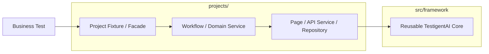
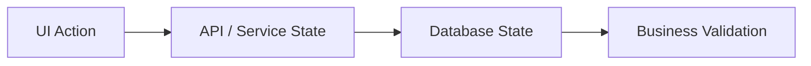
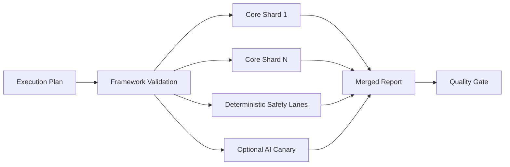

<div align="center">

# TestigentAI

### Intelligent Quality Engineering Platform

**Production-style Playwright + TypeScript automation for UI, API, Database, AI-assisted testing, multi-project execution, CI/CD and business-readable quality reporting.**

[](https://github.com/raushan-raj-ai-engineer/testigent-ai/actions/workflows/playwright-sharded.yml)


**One reusable core. Many products. Explicit project ownership. Human-governed automation. Business-readable quality reporting.**

[Quick Start](#quick-start) · [What It Solves](#what-testigentai-solves) · [Capabilities](#core-capabilities) · [Architecture](#architecture) · [Unified Authoring](#ai-assisted-human-governed-test-authoring) · [UI + API + DB](#cross-layer-ui--api--database-testing) · [CI/CD](#cicd-and-release-confidence) · [Reporting](#business-standard-reporting) · [Docs](#documentation)

</div>

---

## Current Release

**Current certified release: `v1.10.3`.**

The unified authoring workflow was introduced on the v1.10.2 line and hardened/certified in `v1.10.3`, including fail-fast requirement-source validation, governed browser exploration, human-reviewed proposal promotion and stronger runtime/external-test isolation.

The release tag remains immutable. The tag-triggered Release Compatibility workflow passed across the supported release matrix, and the current `main` branch also passed the full **TestigentAI Multi-Project CI** after the post-release unified-authoring contract alignment.

Latest verified main CI used in this documentation update:

```text
TestigentAI Multi-Project CI
Run: 35394892371
Result: SUCCESS

✓ Execution Plan
✓ Framework Validation
✓ Project Tests - Shard 1
✓ Project Tests - Shard 2
✓ AI Deterministic Safety
✓ Agentic Deterministic Safety
✓ Product Intelligence Deterministic Safety
✓ Failure Intelligence Deterministic Safety
✓ AI Live Provider Canary (non-blocking)
✓ Merge TestigentAI Reports
```

Release evidence and operational detail belong in [`docs/41-CURRENT-RELEASE-STATUS.md`](docs/41-CURRENT-RELEASE-STATUS.md) and the release-specific certification documents.

### Certification History

- `v1.10.3` is the current certified release.
- `v1.9.3` remains a certified historical release with immutable certification evidence.
- `v1.9.2` remains a historical release retained for release traceability.

Historical certification evidence retained by the release governance contract:

- Current certified release: `v1.9.3`
- v1.9.3 release commit: `b9e3fc1e09fbb39850cc8cc068758ed07d52f942`
- v1.9.3 release compatibility run: `34866842175`
- Historical release: `v1.9.2`

---

## What TestigentAI Solves

TestigentAI is designed for teams that need more than a collection of Playwright test scripts.

It provides a reusable **Quality Engineering platform** where technical capabilities are centralized while each application keeps ownership of its own selectors, business workflows, APIs, database repositories, test data and authentication behavior.

### Core design rule

> Reusable capability belongs in `src/framework/`. Product/application behavior belongs in `projects/<project>/`.

This keeps the framework reusable across products without turning the repository into a single-application automation suite.

### Why it is different

- **UI + API + Database testing in one governed platform**
- **Multi-project architecture** with product-owned business behavior
- **AI-assisted test authoring** without silent production-code promotion
- **Human review and approval** before generated automation becomes active
- **Self-healing with semantic validation**, not “pass at any cost”
- **Deterministic CI separated from unstable external demo dependencies**
- **Sharded and portfolio execution** for multiple products/customers
- **Business reporting** in addition to technical Playwright output
- **Authentication lifecycle management** with verified storage state and bounded recovery
- **Agent/MCP integration** with explicit safety boundaries
- **Architecture, security, reporting and release quality gates**

---

## Core Capabilities

| Capability | What TestigentAI provides |
|---|---|
| **UI automation** | Playwright Page Objects, workflows, web-first assertions and governed locator plans |
| **API testing** | Reusable HTTP infrastructure with project-owned domain services, payloads and contract-aware validation |
| **Database validation** | Capability-aware PostgreSQL, MySQL and MSSQL support with project-owned repositories |
| **Cross-layer E2E** | Business scenarios that can correlate UI, API and database state through one project facade |
| **Data-driven testing** | JSON, CSV, YAML and spreadsheet-oriented data flows with parallel-safe identities |
| **Authentication** | Verified storage state, product-owned auth providers, refresh and bounded runtime recovery |
| **Self-healing** | Deterministic fallback, validated cache and optional lazy AI fallback with semantic post-conditions |
| **AI-assisted authoring** | Requirement planning, exploration, proposal generation, validation and human promotion |
| **MCP / agents** | Governed planner, generator and healer workflows with evidence boundaries |
| **Requirement intelligence** | Requirement analysis, test-plan generation and review-gated proposals |
| **Business reporting** | Executive KPIs, known-defect semantics, evidence, steps and merged shard reporting |
| **Failure intelligence** | Evidence-first classification, fingerprints, blast-radius clustering and fail-honest UNKNOWN outcomes |
| **Change impact** | Explainable changed-code test selection with fail-safe shared-core handling |
| **Execution governance** | Profiles, lanes, tags, workers, retries, sharding and zero-selection protection |
| **CI/CD** | GitHub Actions and Azure Pipelines with deterministic core lanes and optional AI execution |
| **Quality gates** | Architecture, scale, reporting, type, framework, documentation and security contracts |

---

## Architecture



### Dependency rules

- `src/framework/` never imports a product project.
- A project never imports another project.
- Product selectors, routes, SQL, payloads and workflows stay in that product.
- Business specs consume typed project fixtures/facades instead of constructing framework infrastructure directly.
- `npm run architecture:check` enforces the boundary.

### Repository shape

```text
TestigentAI/
├── src/framework/                 # Reusable platform engines
│   ├── core/                      # Runtime config, fixtures, auth, UI foundations
│   ├── api/                       # Generic API infrastructure
│   ├── database/                  # Generic DB infrastructure
│   ├── data/                      # Reusable data/execution support
│   ├── reporting/                 # Business + technical reporting
│   ├── healing/                   # Governed locator recovery
│   ├── ai/                        # Provider-neutral AI abstractions
│   ├── agentic/                   # Planner/generator/reviewer/trust/evidence
│   ├── mcp/                       # Governed MCP boundary
│   └── intelligence/              # Requirements, knowledge and generation
│
├── projects/
│   ├── demo/                      # Deterministic reference product
│   └── sdet-practice/             # Authenticated real-world example
│       ├── auth/
│       ├── config/
│       ├── fixtures/
│       ├── src/pages/
│       ├── src/workflows/
│       ├── src/api/
│       ├── src/database/
│       ├── data/
│       ├── requirements/
│       └── tests/
│
├── tests/framework/               # Platform regression contracts
├── templates/project/             # New-product skeleton
├── config/                        # Organization-wide policy
├── docs/                          # Detailed product documentation
├── scripts/                       # Governed CLI / CI / reporting operations
├── agent-prompts/                 # Agent policy / authoring guardrails
├── .github/agents/                # Planner / generator / healer definitions
├── .mcp/ + .mcp.json              # MCP configuration examples
├── .github/workflows/             # GitHub Actions
├── azure-pipelines.yml            # Azure Pipelines
└── playwright.config.ts           # Thin runtime adapter
```

---

## Quick Start

### Prerequisites

- Node.js 22.x
- npm
- Git
- Chromium for the recommended first run

### Install

```bash
npm ci
npx playwright install chromium
```

### Select a product and environment

```bash
npm run project:list
npm run qa:use -- demo qa
npm run qa:doctor
```

### Run tests

```bash
npm run qa:test -- --project=chromium
```

### Open the report

```bash
npm run qa:report
```

### Validate the repository

```bash
npm run validate:final
```

---

## AI-Assisted, Human-Governed Test Authoring

The recommended authoring surface is the unified `qa create` workflow.

```text
Requirement
    ↓
Approved Application Knowledge / Exploration / Guided Learning
    ↓
Generated Proposal
    ↓
Architecture + Type + Authoring Validation
    ↓
Human Review
    ↓
Approval
    ↓
Promotion
    ↓
Normal Business Test + CI
```

### Use existing approved application knowledge

```bash
npm run qa -- create projects/<app>/requirements/create-order.md
npm run qa -- create JIRA:PAY-142
```

### Safe automatic exploration

```bash
npm run qa -- create JIRA:PAY-142 --auto-explore
```

### Teach a real business journey

```bash
npm run qa -- create JIRA:PAY-142 --learn="Create Order Journey"
```

Complex UI behavior is detected internally during capture; engineers do not need a separate “complex mode”. Captured evidence can cover dynamic grids/tables, iframes, open Shadow DOM metadata, dialogs, popups, downloads, uploads, keyboard interaction, drag/drop, hover, scroll/infinite-scroll, canvas coordinates and correlated XHR/fetch activity.

### Review and promote

```bash
npm run qa -- create JIRA:PAY-142 \
  --learn="Create Order Journey" \
  --reviewer="QA Lead" \
  --review-and-promote
```

Generated automation remains review-gated. The framework validates proposal content and prevents silent destructive overwrite of human-owned active tests.

Legacy authoring entry points remain compatibility aliases where required, but new documentation should lead with the unified `npm run qa -- create ...` workflow.

---

## Cross-Layer UI + API + Database Testing

TestigentAI is not limited to browser automation.



### UI

Use Page Objects/LocatorPlans for mechanics and workflows for business journeys. Prefer roles, labels and stable test IDs. Fixed sleeps are not the synchronization strategy.

### API

Reusable HTTP/auth/validation infrastructure belongs in `src/framework/api`; endpoint routes, payloads and business-domain services remain project-owned.

### Database

Supported capability modes include:

```text
none | postgres | mysql | mssql
```

Database behavior is project/environment owned:

- project configuration controls whether DB capability is enabled;
- credentials stay in secret environment variables;
- optional + unavailable DB capability can skip clearly;
- required + unavailable DB capability fails readiness before execution;
- generated DB validation is read-only and parameterized by default.

Typical lane commands:

```bash
npm run test:ui
npm run test:api
npm run test:db
npm run test:e2e
```

---

## Governed Self-Healing

Self-healing is designed to recover locator drift **without hiding product defects**.

```text
Primary locator
    ↓
Reviewed deterministic fallback
    ↓
Semantically validated healing cache
    ↓
Optional lazy AI proposal
    ↓
Locator safety validation
    ↓
Perform action
    ↓
Semantic business post-condition
    ↓
Cache only validated dynamic recovery
```

A recovered locator is not considered successful merely because Playwright clicked something. The business post-condition must still pass.

Runtime AI remains optional and lazy. Healthy deterministic tests do not initialize an AI provider.

---

## Multi-Project / Customer Portfolio Execution

One TestigentAI installation can serve one product, selected products, a customer portfolio or every registered project.

### One product

```bash
APP=portal ENV=qa npm run test:project -- --project=chromium
```

### Selected products

```bash
npm run test:projects -- \
  --apps=portal,payments,claims \
  --env=qa \
  --profile=regression \
  --project=chromium
```

### All registered products

```bash
npm run test:projects -- \
  --all \
  --env=qa \
  --profile=regression \
  --project=chromium
```

### Named portfolio

```bash
npm run test:projects -- \
  --group=customer-a \
  --profile=regression \
  --project=chromium
```

Each product keeps its own auth state, test data, business behavior and report while the portfolio view provides an estate-level summary.

---

## Authentication Lifecycle

Authentication policy is reusable; login mechanics remain product-owned.

Key properties:

- verified storage state before promotion;
- atomic state replacement;
- single-flight parallel refresh per runner;
- bounded runtime recovery;
- mutating actions are not blindly replayed;
- credentials remain outside source control.

Typical commands:

```bash
npm run auth:check
npm run auth:prepare
npm run qa:auth   # MFA/manual-only capture when required
```

---

## Business-Standard Reporting

TestigentAI separates test-run mechanics, product quality and CI-blocking state.

| Business outcome | Quality | CI blocking |
|---|---:|---:|
| `PASSED` | Pass | No |
| `PASSED_WITH_HEALING` | Pass | No |
| `PASSED_AFTER_RETRY` | Pass | No |
| `KNOWN_DEFECT` | Fail | No, when explicitly accepted |
| `FAILED` | Fail | Yes |
| `SKIPPED` / blocked capability | Neutral | No |
| `UNEXPECTED_PASS` | Pass | Yes until stale expectation is reviewed |

Report surfaces include technical Playwright output, project business dashboards, merged CI reporting and multi-project/customer portfolio summaries.

```bash
npm run report:open
npm run report:dashboard
npm run report:business
npm run report:mail:preview
```

> Recommended public-repo improvement: add screenshots of the business dashboard, evidence view and one successful CI execution under `assets/readme/` and link them here.

---

## CI/CD and Release Confidence

TestigentAI ships with GitHub Actions and Azure Pipelines support.



The CI design separates deterministic product/framework certification from unstable public/demo integrations. External demo endpoints can still be checked explicitly without allowing temporary third-party availability to decide whether the framework itself is healthy.

Useful commands:

```bash
npm run validate:final
npm run test:external
```

Example optional external enforcement:

```bash
RUN_EXTERNAL_TESTS=true \
PERFORMANCE_BUDGET_ENFORCED=true \
npm run test:external
```

---

## Quality Gates

Before merging reusable framework changes:

```bash
npm run validate:final
```

The validation chain covers release/static integrity, architecture boundaries, unified-authoring contracts, framework health, scale/profile auditing, scenario validation, documentation contracts, reporting contracts, TypeScript checks, review-hardening regressions, framework-critical tests and security checks.

Useful individual checks include:

```bash
npm run architecture:check
npm run authoring:unified-contract
npm run framework:health
npm run scale:audit
npm run scenario:doctor
npm run docs:comment-audit
npm run reporting:contract
npm run typecheck
npm run test:review:hardening
npm run test:framework:critical
npm run security:check
```

---

## Add a New Product

Generate a governed project skeleton rather than copying another product manually:

```bash
npm run project:new -- checkout
```

Typical product-owned structure:

```text
projects/checkout/
├── project.json
├── config/qa.json
├── auth/auth.provider.ts
├── fixtures/test.fixture.ts
├── src/app.facade.ts
├── src/pages/
├── src/workflows/
├── src/api/
├── src/database/
├── data/
├── requirements/
└── tests/
```

A new product should not require changes in `src/framework/` unless the team is adding capability that is truly reusable across products.

---

## Daily Developer Workflow

Keep normal usage intentionally small:

```bash
npm run qa:status
npm run qa:doctor
npm run qa -- create <requirement-source>
npm run qa:test -- --project=chromium
npm run qa:validate
npm run qa:report
npm run qa:impact -- --base main --head HEAD
```

For framework/release work:

```bash
npm run validate:final
```

For external/public demo integrations:

```bash
npm run test:external
```

---

## Security and Governance

- Secrets never belong in source control.
- Generated automation is review-gated before promotion.
- API generation is contract/evidence-driven; routes and payloads are not invented.
- Database generation is read-only by default; destructive SQL is blocked from governed proposals.
- AI cannot override deterministic quality facts.
- Healing cannot weaken functional assertions or silently rewrite business contracts.
- Auth state, runtime state, healing state, reports and test output remain excluded from source control where appropriate.

Start local configuration from:

```bash
cp .env.example .env
```

---

## Documentation

The README is intentionally a **public landing page**. Deep operational and historical detail should remain in `docs/`.

Recommended starting points:

| Topic | Document |
|---|---|
| First-time onboarding | [`docs/00-START-HERE.md`](docs/00-START-HERE.md) |
| Architecture | [`docs/01-ARCHITECTURE.md`](docs/01-ARCHITECTURE.md) |
| Daily commands | [`docs/02-DAILY-COMMANDS.md`](docs/02-DAILY-COMMANDS.md) |
| Add a product | [`docs/03-ADD-NEW-PROJECT.md`](docs/03-ADD-NEW-PROJECT.md) |
| Auth / secrets / environments | [`docs/04-AUTH-SECRETS-ENVIRONMENTS.md`](docs/04-AUTH-SECRETS-ENVIRONMENTS.md) |
| UI / API / DB / data | [`docs/05-UI-API-DB-DATA.md`](docs/05-UI-API-DB-DATA.md) |
| Reporting / CI/CD | [`docs/06-REPORTING-CI-CD.md`](docs/06-REPORTING-CI-CD.md) |
| Healing / AI / MCP | [`docs/07-HEALING-AI-MCP.md`](docs/07-HEALING-AI-MCP.md) |
| Requirement intelligence | [`docs/08-REQUIREMENT-INTELLIGENCE.md`](docs/08-REQUIREMENT-INTELLIGENCE.md) |
| Multi-project execution | [`docs/18-MULTI-PROJECT-EXECUTION.md`](docs/18-MULTI-PROJECT-EXECUTION.md) |
| Agent UI/API/DB/E2E authoring | [`docs/29-AGENT-AUTHORING-UI-API-DB-E2E.md`](docs/29-AGENT-AUTHORING-UI-API-DB-E2E.md) |
| Recovery architecture | [`docs/30-RECOVERY-ARCHITECTURE.md`](docs/30-RECOVERY-ARCHITECTURE.md) |
| Current release status | [`docs/41-CURRENT-RELEASE-STATUS.md`](docs/41-CURRENT-RELEASE-STATUS.md) |
| v1.10.2 unified authoring design | [`docs/73-v1.10.2-UNIFIED-TEST-CREATION.md`](docs/73-v1.10.2-UNIFIED-TEST-CREATION.md) |
| v1.10.3 source-validation hotfix | [`docs/75-v1.10.3-SOURCE-VALIDATION-HOTFIX.md`](docs/75-v1.10.3-SOURCE-VALIDATION-HOTFIX.md) |
| v1.10.3 final certification | [`docs/76-v1.10.3-FINAL-CERTIFICATION.md`](docs/76-v1.10.3-FINAL-CERTIFICATION.md) |
| Public project overview | [`docs/77-v1.10.3-PUBLIC-PROJECT-OVERVIEW.md`](docs/77-v1.10.3-PUBLIC-PROJECT-OVERVIEW.md) |

Release-specific history should live in release notes / release-specific docs instead of growing the main README indefinitely.

---

## Engineering Principles

1. **Reusable core, product-owned behavior.**
2. **Configuration over hard-coded environments.**
3. **Secrets never belong in source control.**
4. **Business tests express intent; infrastructure stays behind typed fixtures/facades.**
5. **Known defects remain quality failures, not fake passes.**
6. **Healing must prove business success before it is trusted.**
7. **AI is optional, lazy at runtime, and cannot override deterministic quality facts.**
8. **No silent zero-test success.**
9. **Generated automation stays review-gated until human promotion.**
10. **Every CI topology must produce one authoritative merged quality view.**
11. **Agent-generated UI/API/DB/E2E automation becomes trusted only after human approval.**
12. **Recovery may repair mechanics/transients, never silently rewrite business contracts.**
13. **Measured evidence, not feature count, is the boundary for adoption, benchmark and scale claims.**

---

## Portfolio / Recruiter Summary

TestigentAI demonstrates automation architecture across:

**Playwright · TypeScript · UI Automation · REST API Testing · Database Testing · PostgreSQL · MySQL · MSSQL · End-to-End Testing · Multi-Project Architecture · SDET · Quality Engineering · GitHub Actions · Azure Pipelines · CI/CD · AI-Assisted Testing · Agentic Testing · MCP · Self-Healing · Business Reporting · Test Governance**

The implementation, architecture, validation contracts and documentation are available in this repository so technical reviewers can inspect the engineering decisions directly.

---

<div align="center">

### TestigentAI

**Build reusable automation infrastructure once. Keep product knowledge where it belongs. Report quality in language stakeholders can trust.**

Maintained as an intelligent Quality Engineering platform for scalable multi-product automation.

**Author: Raushan Raj**

</div>
